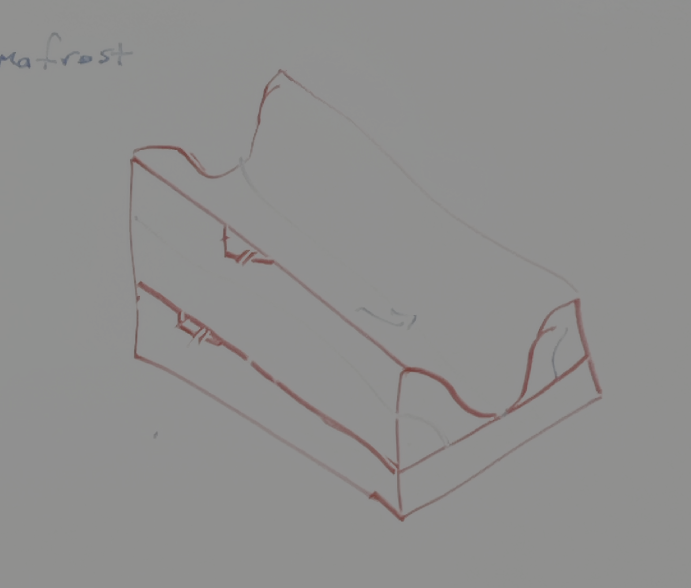

# 2025-glacier-outbursts
ESPIn 2025 project exploring landscape influence of glacial outburst events.

Contributors:
* Viet M Bui (organic rice fed - Delta & SLR dude)
* Ari Koeppel (sol3ling)
* Shayla Triantafillou (river gal)
* Karin Lehnigk (glof club)
* Lucille Baker-Stahl (temperature + morphodynamics = ?)
* Tom Hoseason (tbd)

Project Summary

  This project explores sediment movement in a de-glacieted landscape. We are going to do this by exploring lateral moraine diffusion and its interactions with fluvial transport. Moraine diffusion will be influenced by thawing of an ice-rich core (represented as "bedrock lowering") and diffusion will be calculated using a depth dependent diffusion componenent. 

Project Steps:
* Generate topography
*   Must have down-valley slope, mirrored sin moraines parrallel to valley gradient
* Classify sub-surface land classes
* Diffusion
* Ice melting
* Channelized water flow
* Sediment transport 

